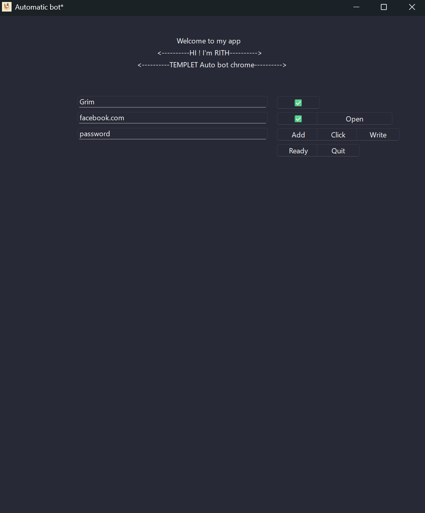

# Automatic Bot Application

**Automatic Bot Application**
Built with PySide6 that automates browser interactions using Selenium.

---
## Features

- **Repeatedly Actions**:Uses Selenium to automate browser actions.
  
---


### Installation


   ```:)
   git clone https://github.com/TinaGrim/selenium_framework.git
   cd Selenium_Framework
   pip install -r requirements.txt
   python main.py
   ```


### Example

1. Enter "MyApp"
2. Enter "example.com"
3. Add an XPath (`/html/body/div[1]/.../div[1]/form/div[5]/`)
4. "Click" mode or "Add" mod
5. Click "Ready" to generate the script.
6. ouput as `text_output_pyside6.py`.

## Picture

### Contact

For any questions or feedback, please contact [tinasora5553@gmail.com](mailto:tinasora5553@gmail.com).

---

